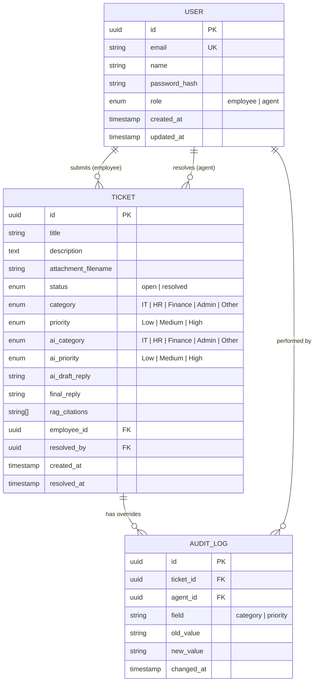

# QuickDesk — Architecture & Design Document

> **Related Docs:** [System Overview](file:///E:/ME/quickdesk/docs/01-system-overview.md) · [Architecture](file:///E:/ME/quickdesk/docs/02-architecture.md) · [Database](file:///E:/ME/quickdesk/docs/03-database.md) · [API](file:///E:/ME/quickdesk/docs/04-api.md) · [AI & RAG](file:///E:/ME/quickdesk/docs/05-ai-rag.md) · [Auth](file:///E:/ME/quickdesk/docs/06-auth.md) · [Realtime](file:///E:/ME/quickdesk/docs/07-realtime.md) · [Deployment](file:///E:/ME/quickdesk/docs/08-deployment.md) · [Testing](file:///E:/ME/quickdesk/docs/09-testing.md)
>
> **Requirements:** [REQUIREMENTS.md](file:///E:/ME/quickdesk/REQUIREMENTS.md) · **Agent Guide:** [AGENT.md](file:///E:/ME/quickdesk/AGENT.md) · **Work Plan:** [WORKPLAN.md](file:///E:/ME/quickdesk/WORKPLAN.md)

---

## 1. System Overview

QuickDesk is an AI-assisted internal helpdesk application. The system follows a **client-server architecture** with real-time communication, an LLM-powered RAG pipeline for intelligent ticket handling, and role-based access control.

```
┌─────────────────────────────────────────────────────────────────────────┐
│                           QUICKDESK SYSTEM                              │
│                                                                         │
│  ┌──────────────┐    HTTP/WS     ┌──────────────────┐    SQL     ┌────┐│
│  │   Frontend    │◄────────────►│     Backend       │◄─────────►│ DB ││
│  │  (Next.js)    │              │   (Nest.js)       │           │(PG)││
│  │              │              │                    │           └────┘│
│  │  - Auth Pages │              │  - Auth Module     │                 │
│  │  - Employee   │              │  - Tickets Module  │    Embed   ┌───┐│
│  │    Dashboard  │              │  - RAG Module      │◄─────────►│VDB││
│  │  - Agent      │  Socket.io   │  - WebSocket GW    │           │   ││
│  │    Dashboard  │◄────────────►│  - Metrics Module  │           └───┘│
│  │  - Metrics    │              │                    │                 │
│  └──────────────┘              │         ▲          │                 │
│                                 │         │          │                 │
│                                 │    ┌────┴────┐    │                 │
│                                 │    │   LLM   │    │                 │
│                                 │    │(Gemini) │    │                 │
│                                 │    └─────────┘    │                 │
│                                 └──────────────────┘                  │
└─────────────────────────────────────────────────────────────────────────┘
```

---

## 2. Technology Choices

| Layer | Technology | Rationale |
|-------|-----------|-----------|
| **Frontend** | Next.js + TypeScript | SSR/SSG capabilities, file-based routing, built-in API routes for BFF pattern, strong TypeScript support |
| **Backend** | Nest.js + TypeScript | Modular architecture with decorators, built-in support for WebSockets, Guards for RBAC, strong DI container |
| **Database** | PostgreSQL | Required by spec. Relational model fits ticket/user domain well. ACID compliance for audit logs |
| **ORM** | Prisma (or TypeORM) | Type-safe database queries, auto-migrations, schema-first design |
| **LLM Provider** | Google Gemini | Fast inference, free tier available, compatible with LangChain |
| **RAG Framework** | LangChain.js | Required by spec. Handles document loading, chunking, embedding, retrieval, and prompt chaining |
| **Vector Store** | pgvector | PostgreSQL extension for vector search |
| **Embeddings** | gemini-embedding-001 | Free tier compatible, good quality for short documents |
| **Real-Time** | Socket.io | Automatic reconnection, room-based broadcasting, fallback to polling, widely supported |
| **Auth** | JWT + bcrypt | Required by spec. Stateless auth, easy role embedding in token payload |
| **Styling** | Tailwind CSS | Rapid UI development, consistent design system, utility-first approach |

---

## 3. Architecture Layers

### 3.1 Frontend Architecture

```
frontend/
├── src/
│   ├── app/                    # Next.js App Router
│   │   ├── (auth)/             # Auth route group
│   │   │   ├── login/
│   │   │   └── register/
│   │   ├── (employee)/         # Employee route group
│   │   │   └── my-tickets/
│   │   ├── (agent)/            # Agent route group
│   │   │   ├── dashboard/
│   │   │   ├── tickets/[id]/
│   │   │   └── metrics/
│   │   ├── layout.tsx
│   │   └── page.tsx
│   ├── components/
│   │   ├── ui/                 # Reusable UI primitives
│   │   ├── tickets/            # Ticket-specific components
│   │   ├── auth/               # Auth forms
│   │   └── layout/             # Navigation, sidebar
│   ├── hooks/                  # Custom React hooks
│   │   ├── useAuth.ts
│   │   ├── useSocket.ts
│   │   └── useTickets.ts
│   ├── lib/
│   │   ├── api.ts              # API client (axios/fetch)
│   │   ├── socket.ts           # Socket.io client setup
│   │   └── auth.ts             # JWT storage & refresh
│   ├── context/
│   │   ├── AuthContext.tsx
│   │   └── SocketContext.tsx
│   └── types/                  # TypeScript interfaces
│       ├── ticket.ts
│       ├── user.ts
│       └── api.ts
```

### 3.2 Backend Architecture (Nest.js Modules)

```
backend/
├── src/
│   ├── main.ts                 # Bootstrap
│   ├── app.module.ts           # Root module
│   ├── auth/
│   │   ├── auth.module.ts
│   │   ├── auth.controller.ts  # POST /auth/register, POST /auth/login
│   │   ├── auth.service.ts     # JWT sign/verify, bcrypt hash/compare
│   │   ├── jwt.strategy.ts     # Passport JWT strategy
│   │   ├── roles.guard.ts      # RBAC guard decorator
│   │   └── roles.decorator.ts  # @Roles('agent') decorator
│   ├── users/
│   │   ├── users.module.ts
│   │   ├── users.service.ts
│   │   └── user.entity.ts
│   ├── tickets/
│   │   ├── tickets.module.ts
│   │   ├── tickets.controller.ts  # CRUD + filters + search
│   │   ├── tickets.service.ts
│   │   ├── ticket.entity.ts
│   │   └── audit-log.entity.ts
│   ├── ai/
│   │   ├── ai.module.ts
│   │   ├── ai.service.ts         # LLM calls for categorization + priority
│   │   ├── rag.service.ts        # RAG pipeline: embed → retrieve → generate
│   │   └── knowledge-base/       # Handles admin uploaded files
│   ├── websocket/
│   │   ├── websocket.module.ts
│   │   ├── websocket.gateway.ts  # Socket.io gateway
│   │   └── websocket.guard.ts    # WS auth guard
│   ├── metrics/
│   │   ├── metrics.module.ts
│   │   ├── metrics.controller.ts
│   │   └── metrics.service.ts
│   ├── seed/
│   │   └── seed.ts               # Seed script
│   └── prisma/
│       ├── prisma.module.ts
│       ├── prisma.service.ts
│       └── schema.prisma
```

---

## 4. Database Schema



---

## 5. API Design

### 5.1 Auth Endpoints

| Method | Path | Purpose | Auth |
|--------|------|---------|------|
| `POST` | `/api/auth/register` | Register new user (employee/agent) | ❌ |
| `POST` | `/api/auth/login` | Login, returns JWT | ❌ |
| `GET` | `/api/auth/me` | Get current user profile | ✅ Any |

### 5.2 Ticket Endpoints

| Method | Path | Purpose | Auth |
|--------|------|---------|------|
| `POST` | `/api/tickets` | Create a new ticket (triggers AI categorization) | ✅ Employee |
| `GET` | `/api/tickets` | Get tickets (employees: own only; agents: all + filters) | ✅ Any |
| `GET` | `/api/tickets/:id` | Get ticket detail | ✅ Any (scoped) |
| `PATCH` | `/api/tickets/:id/category` | Override AI category | ✅ Agent |
| `PATCH` | `/api/tickets/:id/priority` | Override AI priority | ✅ Agent |
| `POST` | `/api/tickets/:id/reply` | Send reply (stores final reply, resolves ticket) | ✅ Agent |

### 5.3 AI / RAG Endpoints

| Method | Path | Purpose | Auth |
|--------|------|---------|------|
| `POST` | `/api/ai/draft-reply` | Generate RAG-based draft reply for a ticket | ✅ Agent |
| `GET` | `/api/tickets/:id/audit-log` | Get override audit log for a ticket | ✅ Agent |

### 5.4 Metrics Endpoints

| Method | Path | Purpose | Auth |
|--------|------|---------|------|
| `GET` | `/api/metrics/overview` | Ticket stats: by status, by category, median resolution, AI override % | ✅ Agent |

### 5.5 WebSocket Events

| Event | Direction | Payload | Description |
|-------|-----------|---------|-------------|
| `ticket:new` | Server → Agents | `{ ticket }` | New ticket submitted |
| `ticket:resolved` | Server → Employee | `{ ticketId, reply }` | Ticket resolved |
| `connect` | Client → Server | JWT in handshake | Authenticate socket connection |

---

## 6. RAG Pipeline Design

```
┌──────────────┐     ┌──────────────┐     ┌─────────────┐     ┌──────────┐
│  Knowledge   │     │   Document   │     │  Embedding  │     │  Vector  │
│  Base (MD)   │────►│   Chunking   │────►│   Model     │────►│  Store   │
│Admin uploaded│     │  ~200 tokens │     │  (Gemini)   │     │(pgvector)│
└──────────────┘     └──────────────┘     └─────────────┘     └────┬─────┘
                                                                    │
                                                              Retrieval
                                                                    │
┌──────────────┐     ┌──────────────┐     ┌─────────────┐     ┌────▼─────┐
│  AI Draft    │◄────│   LLM Call   │◄────│   Prompt    │◄────│  Top-K   │
│  Response    │     │   (Gemini)   │     │  Template   │     │ Relevant │
│  + Citations │     └──────────────┘     └─────────────┘     │  Chunks  │
└──────────────┘                                              └──────────┘
```

### Pipeline Steps:
1. **Load**: Read markdown files from admin uploads (stored in DB and `backend/uploads/knowledge-base/`)
2. **Split**: Chunk documents using `RecursiveCharacterTextSplitter` (~200-300 token chunks, 50 token overlap)
3. **Embed**: Generate embeddings using Gemini embedding model
4. **Store**: Index embeddings in PostgreSQL using pgvector
5. **Retrieve**: On ticket query, find top-K (k=4) most similar chunks
6. **Generate**: Pass ticket + retrieved chunks to LLM with structured prompt
7. **Return**: AI draft reply + source citations (document names)

### Category Suggestion Prompt:
```
Given the following support ticket, classify it into ONE of these categories:
IT, HR, Finance, Admin, Other

Also assign a priority: Low, Medium, High

Respond ONLY in this JSON format:
{ "category": "...", "priority": "..." }

Ticket Title: {title}
Ticket Description: {description}
```

> **Fallback**: If the LLM returns a category not in the allowed list, default to `"Other"` and log the anomaly.

---

## 7. Authentication & Authorization Flow

```
┌────────┐     POST /auth/login      ┌─────────┐
│ Client │ ─────────────────────────► │ Backend │
│        │                            │         │
│        │  ◄── JWT { role, userId }  │  bcrypt │
│        │                            │  verify │
│        │     GET /api/tickets       │         │
│        │  ── Authorization: Bearer  │         │
│        │     ────────────────────►  │         │
│        │                            │ JWT     │
│        │                            │ Guard   │
│        │                            │   ↓     │
│        │                            │ Roles   │
│        │                            │ Guard   │
│        │  ◄── 200 | 403 Forbidden   │         │
└────────┘                            └─────────┘
```

### JWT Storage (Client):
- Store in **httpOnly cookie** (preferred for XSS protection) or **localStorage** (simpler, document tradeoff)
- Token payload: `{ userId, email, role, iat, exp }`

### RBAC Enforcement (Backend):
1. **JwtAuthGuard**: Validates JWT signature and expiry on every request
2. **RolesGuard**: Checks `user.role` against endpoint's `@Roles()` decorator
3. **Ownership check**: For employee endpoints, filter tickets by `employee_id = currentUser.id`

---

## 8. Real-Time Architecture (Socket.io)

```
┌──────────┐                    ┌──────────────┐                    ┌──────────┐
│ Employee │  ── socket.io ──►  │   Backend    │  ◄── socket.io ──  │  Agent   │
│  Client  │                    │  WS Gateway  │                    │  Client  │
│          │                    │              │                    │          │
│ Room:    │                    │ On ticket    │                    │ Room:    │
│ user:{id}│  ◄─ ticket:       │ creation:    │  ─► ticket:new ──► │ agents   │
│          │    resolved        │ emit to      │                    │          │
└──────────┘                    │ "agents" room│                    └──────────┘
                                │              │
                                │ On resolve:  │
                                │ emit to      │
                                │ user:{empId} │
                                └──────────────┘
```

### Socket Rooms:
- **`agents`**: All connected agent clients join this room → receive `ticket:new` events
- **`user:{userId}`**: Each employee joins their personal room → receives `ticket:resolved` events

### Failure Handling:
- Socket.io has **automatic reconnection** with exponential backoff
- On reconnect, client fetches latest state via REST API to catch missed events
- Auth via JWT in handshake `auth` field

---

## 9. Metrics Computation

| Metric | Query Logic |
|--------|-------------|
| Tickets by status | `GROUP BY status` → count open vs resolved |
| Tickets by category | `GROUP BY category` → count per category |
| Median resolution time | `resolved_at - created_at` → compute median over resolved tickets |
| AI override rate | `COUNT(audit_logs WHERE field='category') / COUNT(resolved_tickets)` × 100 |

---

## 10. Security Considerations

| Concern | Mitigation |
|---------|-----------|
| Plaintext passwords | bcrypt with salt rounds ≥ 10 |
| XSS | httpOnly cookies for JWT, input sanitization |
| CSRF | SameSite cookie attribute, CORS configuration |
| API key exposure | `.env` file + `.env.example` (no real keys in git) |
| Role escalation | Backend guards on every route, JWT role claim verified server-side |
| SQL injection | ORM (Prisma) parameterized queries |

---

## 11. Deployment Architecture (Stretch)

```yaml
# docker-compose.yml
services:
  frontend:
    build: ./frontend
    ports: ["3000:3000"]
    depends_on: [backend]

  backend:
    build: ./backend
    ports: ["4000:4000"]
    depends_on: [postgres]
    env_file: .env

  postgres:
    image: postgres:16
    volumes: [pgdata:/var/lib/postgresql/data]
    environment:
      POSTGRES_DB: quickdesk
      POSTGRES_USER: quickdesk
      POSTGRES_PASSWORD: quickdesk
```
