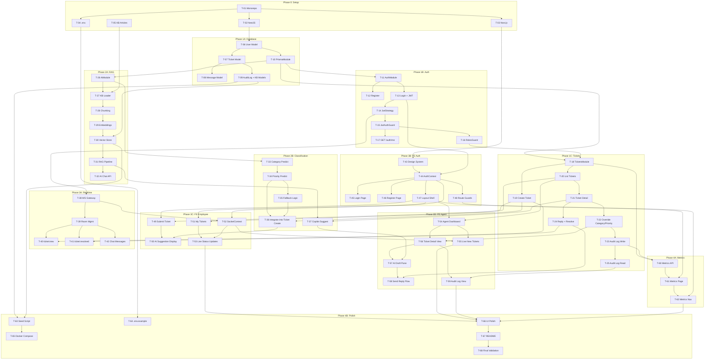

# QuickDesk — Work Plan & Progress Tracker

> **Last Updated:** 2026-07-25 · **Overall Progress:** 5/62 tasks complete (8%)
>
> **Related Docs:** [REQUIREMENTS.md](file:///E:/ME/quickdesk/REQUIREMENTS.md) · [DESIGN.md](file:///E:/ME/quickdesk/DESIGN.md) · [AGENT.md](file:///E:/ME/quickdesk/AGENT.md)

---

## 🤖 Agent Instructions

> [!IMPORTANT]
> **Every AI agent working on this project MUST follow these rules:**
>
> 1. **Before starting any task**, read this file to find the next unblocked task.
> 2. **Pick tasks in order** within each phase. Do not skip to later phases unless current phase is complete.
> 3. **Check dependencies** — a task with status ⬜ whose dependencies are not ✅ is **BLOCKED**.
> 4. **Update this file** after completing each task:
>    - Change status from `⬜ Not Started` → `🔄 In Progress` when you begin
>    - Change status from `🔄 In Progress` → `✅ Done` when complete
>    - Add the completion date in the **Completed** column
>    - If a task is blocked, set status to `⏸️ Blocked` and note the reason
> 5. **Do NOT modify task IDs or dependency references.**
> 6. **Commit after each completed task** with message format: `feat(<scope>): <description> [TASK-XX]`
> 7. **Reference the linked doc** for detailed specs before implementing.

---

## 📊 Progress Summary

| Phase | Total | ✅ Done | 🔄 Active | ⬜ Pending | ⏸️ Blocked |
|-------|:-----:|:------:|:---------:|:---------:|:----------:|
| **Phase 0: Project Setup** | 5 | 5 | 0 | 0 | 0 |
| **Phase 1A: Database & Prisma** | 5 | 5 | 0 | 0 | 0 |
| **Phase 1B: Auth Module** | 7 | 7 | 0 | 0 | 0 |
| **Phase 1C: Tickets Module** | 8 | 0 | 0 | 8 | 0 |
| **Phase 2A: Knowledge Base & RAG** | 7 | 0 | 0 | 7 | 0 |
| **Phase 2B: AI Classification** | 5 | 0 | 0 | 5 | 0 |
| **Phase 3A: Real-Time (Socket.io)** | 5 | 0 | 0 | 5 | 0 |
| **Phase 3B: Frontend — Auth & Layout** | 6 | 0 | 0 | 6 | 0 |
| **Phase 3C: Frontend — Employee Views** | 5 | 0 | 0 | 5 | 0 |
| **Phase 3D: Frontend — Agent Views** | 6 | 0 | 0 | 6 | 0 |
| **Phase 4A: Metrics & Analytics** | 3 | 0 | 0 | 3 | 0 |
| **Phase 4B: Polish & Deliverables** | 6 | 0 | 0 | 6 | 0 |
| **TOTAL** | **68** | **17** | **0** | **51** | **0** |

---

## Phase 0: Project Setup

> Initial project scaffolding and configuration.

| ID | Task | Type | Status | Depends On | Completed | Ref Doc |
|----|------|:----:|:------:|:----------:|:---------:|---------|
| T-01 | Initialize monorepo with npm workspaces | DevOps | ✅ Done | — | 2026-07-24 | — |
| T-02 | Scaffold NestJS backend (`backend/`) | Backend | ✅ Done | T-01 | 2026-07-24 | [02-architecture.md](file:///E:/ME/quickdesk/docs/02-architecture.md) |
| T-03 | Scaffold Next.js frontend (`frontend/`) | Frontend | ✅ Done | T-01 | 2026-07-24 | [02-architecture.md](file:///E:/ME/quickdesk/docs/02-architecture.md) |
| T-04 | Create `.env` with all required variables | DevOps | ✅ Done | T-01 | 2026-07-24 | [08-deployment.md](file:///E:/ME/quickdesk/docs/08-deployment.md) |
| T-05 | Write knowledge base markdown articles (5 files) | Content | ✅ Done | — | 2026-07-24 | [05-ai-rag.md](file:///E:/ME/quickdesk/docs/05-ai-rag.md) |

---

## Phase 1A: Database & Prisma

> PostgreSQL schema design, Prisma ORM setup, and migrations.
> **Spec:** [03-database.md](file:///E:/ME/quickdesk/docs/03-database.md)

| ID | Task | Type | Status | Depends On | Completed | Ref Doc |
|----|------|:----:|:------:|:----------:|:---------:|---------|
| T-06 | Define Prisma schema — `User` model with role enum (`EMPLOYEE`, `AGENT`, `ADMIN`) | Backend | ✅ Done | T-02 | 2026-07-25 | [03-database.md](file:///E:/ME/quickdesk/docs/03-database.md#L83-L90) |
| T-07 | Define Prisma schema — `Ticket` model with status, category, priority enums and AI fields (`aiCategory`, `aiPriority`, `aiDraftReply`, `finalReply`, `ragCitations`) | Backend | ✅ Done | T-06 | 2026-07-25 | [03-database.md](file:///E:/ME/quickdesk/docs/03-database.md#L92-L102) |
| T-08 | Define Prisma schema — `Message` model (ticket chat) | Backend | ✅ Done | T-07 | 2026-07-25 | [03-database.md](file:///E:/ME/quickdesk/docs/03-database.md#L104-L110) |
| T-09 | Define Prisma schema — `AuditLog` model + `KnowledgeArticle` & `KnowledgeArticleChunk` models (with pgvector) | Backend | ✅ Done | T-07 | 2026-07-25 | [03-database.md](file:///E:/ME/quickdesk/docs/03-database.md#L112-L133) |
| T-10 | Create `PrismaModule` & `PrismaService` as global NestJS module | Backend | ✅ Done | T-06 | 2026-07-25 | [02-architecture.md](file:///E:/ME/quickdesk/docs/02-architecture.md#L55) |

---

## Phase 1B: Authentication Module

> JWT-based auth, bcrypt password hashing, role guards.
> **Spec:** [06-auth.md](file:///E:/ME/quickdesk/docs/06-auth.md)

| ID | Task | Type | Status | Depends On | Completed | Ref Doc |
|----|------|:----:|:------:|:----------:|:---------:|---------|
| T-11 | Create `AuthModule` with `AuthController` and `AuthService` | Backend | ✅ Done | T-10 | 2026-07-25 | [06-auth.md](file:///E:/ME/quickdesk/docs/06-auth.md#L7-L31) |
| T-12 | Implement `POST /api/auth/register` — hash password with bcrypt (10 salt rounds), create user, return user object | Backend | ✅ Done | T-11 | 2026-07-25 | [04-api.md](file:///E:/ME/quickdesk/docs/04-api.md#L9-L27) |
| T-13 | Implement `POST /api/auth/login` — verify bcrypt hash, sign JWT (HS256, 15min access + 7d refresh), return token + user | Backend | ✅ Done | T-11 | 2026-07-25 | [04-api.md](file:///E:/ME/quickdesk/docs/04-api.md#L29-L49) |
| T-14 | Implement `JwtStrategy` (Passport) — extract & verify Bearer token, attach user to request | Backend | ✅ Done | T-13 | 2026-07-25 | [06-auth.md](file:///E:/ME/quickdesk/docs/06-auth.md#L87-L98) |
| T-15 | Implement `JwtAuthGuard` — global guard that validates JWT on protected routes | Backend | ✅ Done | T-14 | 2026-07-25 | [06-auth.md](file:///E:/ME/quickdesk/docs/06-auth.md#L97) |
| T-16 | Implement `RolesGuard` + `@Roles()` decorator — check `req.user.role` against endpoint metadata | Backend | ✅ Done | T-15 | 2026-07-25 | [06-auth.md](file:///E:/ME/quickdesk/docs/06-auth.md#L88-L99) |
| T-17 | Implement `GET /api/auth/me` — return current user profile from JWT | Backend | ✅ Done | T-15 | 2026-07-25 | [AGENT.md](file:///E:/ME/quickdesk/AGENT.md) |

---

## Phase 1C: Tickets Module

> Ticket CRUD, agent overrides, audit logging, reply workflow.
> **Spec:** [04-api.md](file:///E:/ME/quickdesk/docs/04-api.md)

| ID | Task | Type | Status | Depends On | Completed | Ref Doc |
|----|------|:----:|:------:|:----------:|:---------:|---------|
| T-18 | Create `TicketsModule` with `TicketsController` and `TicketsService` | Backend | ⬜ Not Started | T-10, T-16 | — | [02-architecture.md](file:///E:/ME/quickdesk/docs/02-architecture.md#L52) |
| T-19 | Implement `POST /api/tickets` — create ticket (employee only), store title, description, attachment filename | Backend | ⬜ Not Started | T-18 | — | [04-api.md](file:///E:/ME/quickdesk/docs/04-api.md#L75-L97) |
| T-20 | Implement `GET /api/tickets` — employees see own tickets only, agents see all with filters (status, category, priority) + search on title | Backend | ⬜ Not Started | T-18 | — | [04-api.md](file:///E:/ME/quickdesk/docs/04-api.md#L55-L73) |
| T-21 | Implement `GET /api/tickets/:id` — ticket detail with ownership check (employee can view own only) | Backend | ⬜ Not Started | T-20 | — | [04-api.md](file:///E:/ME/quickdesk/docs/04-api.md) |
| T-22 | Implement `PATCH /api/tickets/:id/category` and `PATCH /api/tickets/:id/priority` — agent overrides AI suggestion | Backend | ⬜ Not Started | T-21 | — | [REQUIREMENTS.md](file:///E:/ME/quickdesk/REQUIREMENTS.md) |
| T-23 | Implement audit log creation — log (who, when, from_value, to_value) on every category/priority override | Backend | ⬜ Not Started | T-22 | — | [03-database.md](file:///E:/ME/quickdesk/docs/03-database.md#L125-L133) |
| T-24 | Implement `POST /api/tickets/:id/reply` — store final reply, mark ticket as RESOLVED, keep AI draft + final reply | Backend | ⬜ Not Started | T-21 | — | [REQUIREMENTS.md](file:///E:/ME/quickdesk/REQUIREMENTS.md) |
| T-25 | Implement `GET /api/tickets/:id/audit-log` — return override history for a ticket (agent only) | Backend | ⬜ Not Started | T-23 | — | [REQUIREMENTS.md](file:///E:/ME/quickdesk/REQUIREMENTS.md) |

---

## Phase 2A: Knowledge Base & RAG Pipeline

> LangChain RAG setup, document chunking, vector embeddings, similarity search.
> **Spec:** [05-ai-rag.md](file:///E:/ME/quickdesk/docs/05-ai-rag.md)

| ID | Task | Type | Status | Depends On | Completed | Ref Doc |
|----|------|:----:|:------:|:----------:|:---------:|---------|
| T-26 | Create `AiModule` with `RagService` and `AiService` | Backend | ⬜ Not Started | T-10 | — | [02-architecture.md](file:///E:/ME/quickdesk/docs/02-architecture.md#L54) |
| T-27 | Implement KB document loader — read markdown files from `knowledge-base/`, parse with LangChain `DirectoryLoader` | Backend | ⬜ Not Started | T-26, T-05 | — | [05-ai-rag.md](file:///E:/ME/quickdesk/docs/05-ai-rag.md#L48-L55) |
| T-28 | Implement chunking — `RecursiveCharacterTextSplitter` (500 chars, 50 overlap) | Backend | ⬜ Not Started | T-27 | — | [05-ai-rag.md](file:///E:/ME/quickdesk/docs/05-ai-rag.md#L51-L55) |
| T-29 | Implement embedding generation — use Gemini `text-embedding-004` (768-dim vectors) via LangChain | Backend | ⬜ Not Started | T-28 | — | [05-ai-rag.md](file:///E:/ME/quickdesk/docs/05-ai-rag.md#L57-L58) |
| T-30 | Set up vector store — pgvector column in `KnowledgeArticleChunk`, HNSW index, cosine similarity search | Backend | ⬜ Not Started | T-29, T-09 | — | [05-ai-rag.md](file:///E:/ME/quickdesk/docs/05-ai-rag.md#L62-L84) |
| T-31 | Implement RAG retrieval + generation — top-K (k=3) similarity search → prompt template → Gemini LLM → response with citations | Backend | ⬜ Not Started | T-30 | — | [05-ai-rag.md](file:///E:/ME/quickdesk/docs/05-ai-rag.md#L89-L116) |
| T-32 | Implement `POST /api/ai/chat` — RAG-assisted Q&A endpoint for employees, with fallback when no relevant chunks found | Backend | ⬜ Not Started | T-31 | — | [04-api.md](file:///E:/ME/quickdesk/docs/04-api.md#L99-L120) |

---

## Phase 2B: AI Classification & Copilot

> LLM-powered ticket categorization, priority prediction, agent copilot draft.
> **Spec:** [05-ai-rag.md](file:///E:/ME/quickdesk/docs/05-ai-rag.md)

| ID | Task | Type | Status | Depends On | Completed | Ref Doc |
|----|------|:----:|:------:|:----------:|:---------:|---------|
| T-33 | Implement AI category prediction — structured JSON prompt to Gemini, parse response into `IT\|HR\|Finance\|Admin\|Other` | Backend | ⬜ Not Started | T-26 | — | [05-ai-rag.md](file:///E:/ME/quickdesk/docs/05-ai-rag.md#L32-L37) |
| T-34 | Implement AI priority prediction — structured JSON prompt, parse into `Low\|Medium\|High` | Backend | ⬜ Not Started | T-33 | — | [05-ai-rag.md](file:///E:/ME/quickdesk/docs/05-ai-rag.md#L39-L44) |
| T-35 | Implement category validation fallback — if LLM returns invalid category, default to `Other` and log anomaly | Backend | ⬜ Not Started | T-33 | — | [REQUIREMENTS.md](file:///E:/ME/quickdesk/REQUIREMENTS.md) |
| T-36 | Integrate AI classification into ticket creation — call AI on `POST /api/tickets`, store `aiCategory` + `aiPriority` | Backend | ⬜ Not Started | T-19, T-34, T-35 | — | [REQUIREMENTS.md](file:///E:/ME/quickdesk/REQUIREMENTS.md) |
| T-37 | Implement `POST /api/tickets/:id/copilot-suggest` — RAG-based draft reply for agents using ticket context + KB articles | Backend | ⬜ Not Started | T-31, T-21 | — | [04-api.md](file:///E:/ME/quickdesk/docs/04-api.md#L182-L190) |

---

## Phase 3A: Real-Time Communication (Socket.io)

> WebSocket gateway, room management, live updates.
> **Spec:** [07-realtime.md](file:///E:/ME/quickdesk/docs/07-realtime.md)

| ID | Task | Type | Status | Depends On | Completed | Ref Doc |
|----|------|:----:|:------:|:----------:|:---------:|---------|
| T-38 | Create `RealtimeModule` with Socket.io `WebSocketGateway`, JWT handshake auth | Backend | ⬜ Not Started | T-14 | — | [07-realtime.md](file:///E:/ME/quickdesk/docs/07-realtime.md#L7-L24) |
| T-39 | Implement room management — `channel-agents` for all agents, `ticket-{id}` for ticket parties | Backend | ⬜ Not Started | T-38 | — | [07-realtime.md](file:///E:/ME/quickdesk/docs/07-realtime.md#L83-L87) |
| T-40 | Implement `ticket:new` event — emit to `channel-agents` when employee creates ticket (dashboard live update) | Backend | ⬜ Not Started | T-39, T-19 | — | [07-realtime.md](file:///E:/ME/quickdesk/docs/07-realtime.md#L91-L103) |
| T-41 | Implement `ticket:resolved` event — emit to ticket room when agent sends reply (employee sees status flip) | Backend | ⬜ Not Started | T-39, T-24 | — | [07-realtime.md](file:///E:/ME/quickdesk/docs/07-realtime.md#L91-L103) |
| T-42 | Implement `send_message` / `message_received` events — real-time chat in ticket rooms | Backend | ⬜ Not Started | T-39 | — | [07-realtime.md](file:///E:/ME/quickdesk/docs/07-realtime.md#L56-L89) |

---

## Phase 3B: Frontend — Auth & Layout Shell

> Login/register pages, auth context, protected routing, global layout.
> **Spec:** [06-auth.md](file:///E:/ME/quickdesk/docs/06-auth.md) · [02-architecture.md](file:///E:/ME/quickdesk/docs/02-architecture.md)

| ID | Task | Type | Status | Depends On | Completed | Ref Doc |
|----|------|:----:|:------:|:----------:|:---------:|---------|
| T-43 | Create global design system — CSS variables, dark theme, typography (Google Fonts), base styles in `globals.css` | Frontend | ⬜ Not Started | T-03 | — | [02-architecture.md](file:///E:/ME/quickdesk/docs/02-architecture.md#L44) |
| T-44 | Create `AuthContext` + `useAuth` hook — store access token in memory, login/logout/register functions, `GET /api/auth/me` on mount | Frontend | ⬜ Not Started | T-43, T-13 | — | [06-auth.md](file:///E:/ME/quickdesk/docs/06-auth.md#L108-L116) |
| T-45 | Create Login page (`/login`) — email/password form, call `POST /api/auth/login`, redirect by role | Frontend | ⬜ Not Started | T-44 | — | [06-auth.md](file:///E:/ME/quickdesk/docs/06-auth.md#L7-L31) |
| T-46 | Create Register page (`/register`) — email/password/name/role form, call `POST /api/auth/register` | Frontend | ⬜ Not Started | T-44 | — | [04-api.md](file:///E:/ME/quickdesk/docs/04-api.md#L9-L27) |
| T-47 | Create layout shell — sidebar navigation, role-based menu items, header with user info/logout | Frontend | ⬜ Not Started | T-44 | — | [02-architecture.md](file:///E:/ME/quickdesk/docs/02-architecture.md#L153-L161) |
| T-48 | Implement Next.js middleware — protect `/employee/*`, `/agent/*`, `/admin/*` routes based on role | Frontend | ⬜ Not Started | T-44 | — | [06-auth.md](file:///E:/ME/quickdesk/docs/06-auth.md#L100-L105) |

---

## Phase 3C: Frontend — Employee Views

> Ticket submission form, my tickets list, live status updates.
> **Spec:** [AGENT.md](file:///E:/ME/quickdesk/AGENT.md) · [REQUIREMENTS.md](file:///E:/ME/quickdesk/REQUIREMENTS.md)

| ID | Task | Type | Status | Depends On | Completed | Ref Doc |
|----|------|:----:|:------:|:----------:|:---------:|---------|
| T-49 | Create "Submit Ticket" form — title, description, optional attachment filename, submit to `POST /api/tickets` | Frontend | ⬜ Not Started | T-47, T-19 | — | [REQUIREMENTS.md](file:///E:/ME/quickdesk/REQUIREMENTS.md) |
| T-50 | Display AI-suggested category & priority on submission confirmation (marked as "AI-suggested") | Frontend | ⬜ Not Started | T-49, T-36 | — | [REQUIREMENTS.md](file:///E:/ME/quickdesk/REQUIREMENTS.md) |
| T-51 | Create "My Tickets" dashboard — list own tickets with status, category, priority, created date | Frontend | ⬜ Not Started | T-47, T-20 | — | [REQUIREMENTS.md](file:///E:/ME/quickdesk/REQUIREMENTS.md) |
| T-52 | Create `SocketContext` + `useSocket` hook — connect with JWT auth, handle reconnection | Frontend | ⬜ Not Started | T-44, T-38 | — | [07-realtime.md](file:///E:/ME/quickdesk/docs/07-realtime.md#L145-L161) |
| T-53 | Wire real-time updates on "My Tickets" — listen for `ticket:resolved`, update status without refresh | Frontend | ⬜ Not Started | T-51, T-52 | — | [07-realtime.md](file:///E:/ME/quickdesk/docs/07-realtime.md) |

---

## Phase 3D: Frontend — Agent Views

> Agent dashboard, ticket detail, AI draft, override controls, audit log.
> **Spec:** [AGENT.md](file:///E:/ME/quickdesk/AGENT.md) · [REQUIREMENTS.md](file:///E:/ME/quickdesk/REQUIREMENTS.md)

| ID | Task | Type | Status | Depends On | Completed | Ref Doc |
|----|------|:----:|:------:|:----------:|:---------:|---------|
| T-54 | Create Agent Dashboard — list all tickets with filters (status, category, priority) + search on title | Frontend | ⬜ Not Started | T-47, T-20 | — | [REQUIREMENTS.md](file:///E:/ME/quickdesk/REQUIREMENTS.md) |
| T-55 | Wire real-time on Agent Dashboard — listen for `ticket:new`, prepend new tickets without refresh | Frontend | ⬜ Not Started | T-54, T-52 | — | [07-realtime.md](file:///E:/ME/quickdesk/docs/07-realtime.md) |
| T-56 | Create Ticket Detail view — show ticket info, employee name, AI-suggested category/priority with override dropdowns | Frontend | ⬜ Not Started | T-54, T-22 | — | [REQUIREMENTS.md](file:///E:/ME/quickdesk/REQUIREMENTS.md) |
| T-57 | Create AI Draft Reply pane — fetch from `POST /api/tickets/:id/copilot-suggest`, show draft + citations, editable text area | Frontend | ⬜ Not Started | T-56, T-37 | — | [04-api.md](file:///E:/ME/quickdesk/docs/04-api.md#L182-L190) |
| T-58 | Create "Send Reply" flow — agent edits draft, clicks send, calls `POST /api/tickets/:id/reply`, ticket resolves | Frontend | ⬜ Not Started | T-57, T-24 | — | [REQUIREMENTS.md](file:///E:/ME/quickdesk/REQUIREMENTS.md) |
| T-59 | Create Audit Log section on Ticket Detail — show override history (who, when, from, to) | Frontend | ⬜ Not Started | T-56, T-25 | — | [REQUIREMENTS.md](file:///E:/ME/quickdesk/REQUIREMENTS.md) |

---

## Phase 4A: Metrics & Analytics

> Agent-only metrics dashboard.
> **Spec:** [REQUIREMENTS.md](file:///E:/ME/quickdesk/REQUIREMENTS.md) · [04-api.md](file:///E:/ME/quickdesk/docs/04-api.md)

| ID | Task | Type | Status | Depends On | Completed | Ref Doc |
|----|------|:----:|:------:|:----------:|:---------:|---------|
| T-60 | Implement `GET /api/metrics/overview` — total tickets by status, by category, median resolution time, AI override % | Backend | ⬜ Not Started | T-18, T-23 | — | [04-api.md](file:///E:/ME/quickdesk/docs/04-api.md#L196-L212) |
| T-61 | Create Metrics Dashboard page (agent-only) — charts/cards showing stats from `GET /api/metrics/overview` | Frontend | ⬜ Not Started | T-60, T-47 | — | [REQUIREMENTS.md](file:///E:/ME/quickdesk/REQUIREMENTS.md) |
| T-62 | Add metrics navigation — link in agent sidebar, protect route with role guard | Frontend | ⬜ Not Started | T-61, T-48 | — | [06-auth.md](file:///E:/ME/quickdesk/docs/06-auth.md#L100-L105) |

---

## Phase 4B: Polish, Seed Script & Deliverables

> Final polishing, seed data, `.env.example`, README, and demo prep.
> **Spec:** [REQUIREMENTS.md](file:///E:/ME/quickdesk/REQUIREMENTS.md) · [08-deployment.md](file:///E:/ME/quickdesk/docs/08-deployment.md)

| ID | Task | Type | Status | Depends On | Completed | Ref Doc |
|----|------|:----:|:------:|:----------:|:---------:|---------|
| T-63 | Create seed script (`prisma/seed.ts`) — create 1 agent + 1 employee user (bcrypt hashed), load KB articles into vector store | Backend | ⬜ Not Started | T-09, T-30 | — | [03-database.md](file:///E:/ME/quickdesk/docs/03-database.md#L210-L218) |
| T-64 | Create `.env.example` — list all required env variables with placeholder values, no real keys | DevOps | ⬜ Not Started | T-04 | — | [08-deployment.md](file:///E:/ME/quickdesk/docs/08-deployment.md#L18-L32) |
| T-65 | Update `docker-compose.yml` — ensure backend + frontend + postgres spin up correctly | DevOps | ⬜ Not Started | T-63 | — | [08-deployment.md](file:///E:/ME/quickdesk/docs/08-deployment.md#L77-L128) |
| T-66 | UI polish pass — consistent styling, loading states, error states, responsive layout, micro-animations | Frontend | ⬜ Not Started | T-53, T-55, T-59, T-62 | — | [REQUIREMENTS.md](file:///E:/ME/quickdesk/REQUIREMENTS.md) |
| T-67 | Write comprehensive `README.md` — what is it, run instructions, architecture diagram, API table, decisions & tradeoffs, known issues | Docs | ⬜ Not Started | T-66 | — | [REQUIREMENTS.md](file:///E:/ME/quickdesk/REQUIREMENTS.md) |
| T-68 | Final validation — fresh clone test, `npm install` → seed → run → full flow works end to end | QA | ⬜ Not Started | T-67 | — | [REQUIREMENTS.md](file:///E:/ME/quickdesk/REQUIREMENTS.md) |

---

## 🏗️ Dependency Graph

---

## 📝 Change Log

> Record every status update here. Agents must append entries when marking tasks complete.

| Date | Task ID | Change | Notes |
|------|---------|--------|-------|
| 2026-07-24 | T-01 | ⬜ → ✅ | Monorepo initialized with npm workspaces |
| 2026-07-24 | T-02 | ⬜ → ✅ | NestJS backend scaffolded |
| 2026-07-24 | T-03 | ⬜ → ✅ | Next.js frontend scaffolded |
| 2026-07-24 | T-04 | ⬜ → ✅ | Root .env created with DB, JWT, Gemini, port configs |
| 2026-07-24 | T-05 | ⬜ → ✅ | 5 KB articles written (vpn, password, leave, expense, laptop) |
| 2026-07-25 | T-06 | ⬜ → ✅ | Prisma schema User model defined with Role enum |
| 2026-07-25 | T-07 | ⬜ → ✅ | Prisma schema Ticket model defined with Status/Category/Priority enums & AI fields |
| 2026-07-25 | T-08 | ⬜ → ✅ | Prisma schema Message model defined |
| 2026-07-25 | T-09 | ⬜ → ✅ | Prisma schema AuditLog, KnowledgeArticle & Chunk (pgvector) models defined |
| 2026-07-25 | T-10 | ⬜ → ✅ | Global PrismaModule & PrismaService created in NestJS |
| 2026-07-25 | T-11 | ⬜ → ✅ | AuthModule created with AuthController and AuthService |
| 2026-07-25 | T-12 | ⬜ → ✅ | POST /api/auth/register implemented with bcrypt password hashing |
| 2026-07-25 | T-13 | ⬜ → ✅ | POST /api/auth/login implemented with bcrypt compare and JWT signing |
| 2026-07-25 | T-14 | ⬜ → ✅ | JwtStrategy implemented for Bearer token extraction and user payload validation |
| 2026-07-25 | T-15 | ⬜ → ✅ | JwtAuthGuard implemented to protect private endpoints |
| 2026-07-25 | T-16 | ⬜ → ✅ | RolesGuard and @Roles() decorator implemented for backend RBAC enforcement |
| 2026-07-25 | T-17 | ⬜ → ✅ | GET /api/auth/me implemented to return authenticated user profile |

---

## 🚀 Quick Start for Agents

**To find the next task to work on:**

1. Look at the **Progress Summary** table above
2. Find the first phase with pending tasks
3. Within that phase, find the first task with status `⬜ Not Started`
4. Check its **Depends On** column — all dependencies must be `✅ Done`
5. If dependencies are met → start the task, update status to `🔄 In Progress`
6. After completing → update status to `✅ Done`, add date, append to Change Log
7. Update the **Progress Summary** counts

**Current next task:** `T-18` (Create TicketsModule with TicketsController and TicketsService)
