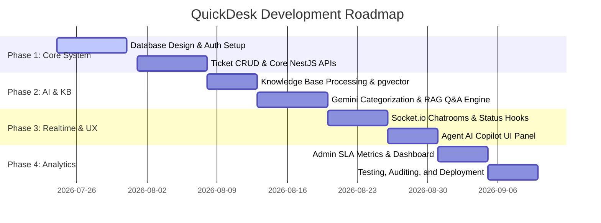

# QuickDesk - System Overview

## Project Overview
QuickDesk is a modern, enterprise-grade AI-Assisted Helpdesk Application designed to streamline internal support processes. By combining traditional ticket lifecycle management with advanced AI categorization, priority triage, and a Retrieval-Augmented Generation (RAG) chatbot, QuickDesk enables instant resolution of employee queries while significantly reducing the operational load on IT, HR, and Finance support teams.

---

## Problem Statement
Internal operations teams are often overwhelmed by a high volume of repetitive support queries. Common requests like password resets, leave policy clarifications, and VPN installation instructions consume valuable time from IT and HR personnel, leading to:
- **Delayed resolution times** for critical infrastructure/business issues.
- **Decreased productivity** of employees waiting on support.
- **Increased operational costs** due to manual handling of trivial queries.
- **Support agent burnout** from repetitive, low-impact tasks.

---

## Solution
QuickDesk solves these problems through an **AI-First Helpdesk workflow**:
1. **Self-Service Deflection**: When an employee starts to report an issue, they interface with a RAG-powered AI chatbot that retrieves matching policies and guides from the Knowledge Base (e.g., password reset portal link, VPN client installer process) to resolve the issue instantly without agent intervention.
2. **AI Triage**: If the AI chatbot cannot resolve the issue, the employee can create a ticket. The AI classification engine automatically predicts the **Category** and **Priority** of the ticket based on the description, routes it to the correct department queue, and assigns a SLA timeline.
3. **Agent Copilot**: For tickets that reach human agents, an AI Copilot analyzes the ticket history and provides smart, context-aware reply drafts, helping agents respond faster.
4. **Real-time Collaboration**: WebSocket-based instant messaging enables smooth and instantaneous communication between the employee and the assigned support agent.

---

## Features

### 1. Employee Portal
- **AI RAG Assistant**: An interactive chat interface that answers questions with citations based on corporate policies.
- **Self-Service Deflection**: Prompts the user to try self-service before submitting a ticket.
- **Ticket Dashboard**: Overview of open/closed tickets, current status (Open, In Progress, Resolved, Closed), and assigned agent.
- **Live Ticket Room**: Secure chat room for direct communication with the assigned agent.

### 2. Agent Dashboard
- **Unified Ticket Queue**: Real-time filterable lists (by Category, Priority, Status, Assignee).
- **One-click Ticket Assignment**: Claims/Reassigns tickets to agents.
- **Agent Copilot Pane**: Side pane displaying AI-suggested responses based on the conversation history and internal docs.
- **Interactive Chat Workspace**: Live messaging with employees.

### 3. Admin & Configuration Panel
- **User & Role Management**: Creation and permission assignment for Employees, Agents, and Admins.
- **Knowledge Base Manager**: Admin UI to upload, process, and chunk markdown-based internal guides into the vector database.
- **Service Metrics & SLA Dashboard**: Core metrics showing average time-to-first-response, ticket resolution rates, and CSAT (Customer Satisfaction) feedback.

---

## User Roles
QuickDesk enforces Role-Based Access Control (RBAC) across three distinct personas:

| Role | Permissions | Key Workflows |
| :--- | :--- | :--- |
| **Employee** | Read-Write own tickets, Read public knowledge base, Chat with AI/assigned agent. | Ask policy questions, Submit tickets, Chat with agent, Provide CSAT. |
| **Agent** | Read all tickets, Write own assigned tickets, Use AI copilot suggestions, Chat with employees. | Assign tickets to self, Communicate with employee, Resolve tickets. |
| **Admin** | Read-Write all resources, Manage users, Manage knowledge base, View metrics dashboard. | Add new agents, Update knowledge base docs, Review SLA compliance analytics. |

---

## Functional Requirements
- **FR-1 (Authentication)**: Secure login using JSON Web Tokens (JWT) with optional MFA verification.
- **FR-2 (Self-Service RAG)**: The AI assistant must extract relevant context from files inside the `knowledge-base/` folder and generate answers with verified citations.
- **FR-3 (AI Auto-Classification)**: The system must automatically predict ticket `Category` (IT, HR, Finance) and `Priority` (Low, Medium, High, Urgent) during ticket creation.
- **FR-4 (Real-time Messaging)**: The ticket chat room must push real-time messages and typing notifications to both parties.
- **FR-5 (AI Response Suggester)**: The agent UI must support a "Suggest Draft" button, prompting Gemini to draft a response using the ticket details.
- **FR-6 (SLA & Escalate)**: If an Urgent ticket is unassigned for more than 30 minutes, it triggers a warning notification.

---

## Non-Functional Requirements
- **NFR-1 (AI Response Latency)**: RAG chatbot response time must be under 3 seconds.
- **NFR-2 (Real-time Latency)**: Live chat latency must be under 100ms.
- **NFR-3 (Security)**: Passwords must be hashed using bcrypt before database storage.
- **NFR-4 (Scalability)**: WebSocket server must support up to 500 concurrent connections.
- **NFR-5 (Responsiveness)**: The web UI must be fully responsive, supporting mobile devices (for employees) and desktop views (for agents).

---

## Tech Stack
The application is built on top of a modern JavaScript ecosystem:

- **Frontend Core**: [Next.js](https://nextjs.org/) (App Router, TypeScript)
- **Styling**: Vanilla CSS with custom properties for a cohesive design system
- **Backend Server**: [NestJS](https://nestjs.com/) (TypeScript)
- **Database ORM**: [Prisma](https://www.prisma.io/)
- **Primary Database**: PostgreSQL (with the `pgvector` extension for vector embeddings)
- **AI Framework**: [LangChain](https://js.langchain.com/) & [Gemini API](https://ai.google.dev/)
- **Real-Time Communication**: [Socket.io](https://socket.io/)

---

## Project Structure
```
quickdesk/
├── backend/                  # NestJS server code
│   ├── src/                  # Application modules (auth, tickets, ai, realtime)
│   ├── prisma/               # Database schema definitions and migrations
│   └── .agents/              # Embedded developer skills and agent configs
├── frontend/                 # Next.js UI code
│   ├── app/                  # Pages, layouts, and CSS files
│   └── public/               # Static assets
├── docs/                     # Comprehensive system documentation
└── knowledge-base/           # Public markdown documents for the RAG system
```

---

## Development Roadmap
