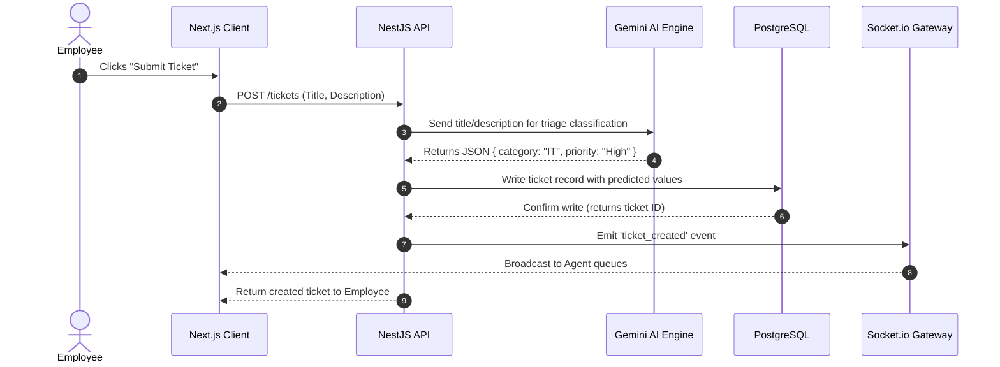
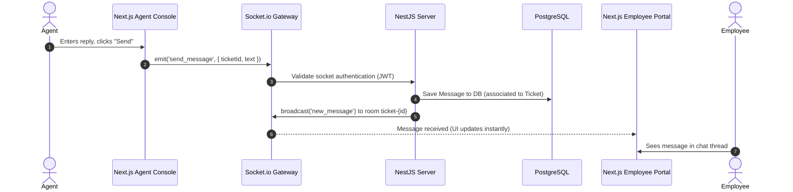

# QuickDesk - Architecture

## Overview
QuickDesk utilizes a decoupled Client-Server architecture designed to run reliably under concurrent load, featuring a reactive web client, a robust REST backend, a real-time event hub, and an asynchronous AI reasoning module.

```
       +---------------------------------------+
       |             Web Browser               |
       |  [Next.js Client App (Employee/Agent)]|
       +-------+-----------------------+-------+
               |                       |
       HTTP / REST                 WebSockets (Socket.io)
               |                       |
       +-------v-----------------------v-------+
       |         NestJS Application Server     |
       |  [Auth, Tickets, Realtime, AI Modules]|
       +-------+-----------------------+-------+
               |                       |
           SQL Queries            HTTPS / API Calls
               |                       |
       +-------v---------------+       +-------v---------------+
       | PostgreSQL Database   |       |   Gemini AI Service   |
       | (with pgvector)       |       | (Embeddings & LLM)    |
       +-----------------------+       +-----------------------+
```

---

## High Level Architecture
The system is divided into four main layers:
1. **Presentation Layer (Frontend)**: Next.js SPA utilizing React Server Components (RSC) for page structure and Client Components for dynamic socket connections, RAG chats, and queues.
2. **Business Logic Layer (Backend)**: A modular NestJS API server providing secure endpoints, database management, and service orchestration.
3. **AI & Vector Retrieval Layer (Agentic Layer)**: LangChain workflows and Gemini API endpoints running vector search queries and text classification.
4. **Data Persistence Layer (Database)**: PostgreSQL storing application records and token embeddings in a unified storage schema.

---

## Frontend
The frontend is built using **Next.js App Router** with TypeScript.

### Design Principles:
- **Component-Driven Isolation**: Complex widgets like the Chat window and the Ticket queue are built as independent components that manage their own local state.
- **WebSocket Synchronization**: The frontend hooks into a global `SocketContext` that subscribes to ticket events. When a state change (e.g., "Ticket Assigned") is received, the client state updates reactively without page reloads.
- **Design Tokens**: Standardized CSS variables (defined in `frontend/app/globals.css`) establish dark-mode aesthetics, custom gradients, and micro-animations.

---

## Backend
The backend application is structured around **NestJS Modules**, promoting strong separation of concerns:

- **`AuthModule`**: Handles user authentication, token generation, password verification, and guards access to endpoints based on user roles (`EMPLOYEE`, `AGENT`, `ADMIN`).
- **`TicketsModule`**: Manages the ticket CRUD operations, state transitions, and hooks into both the AI and Realtime modules.
- **`RealtimeModule`**: Built on `@nestjs/websockets`, this manages active Socket.io connections, message broadcasting, and room-level authorization.
- **`AiModule`**: Connects to the Gemini SDK and LangChain to execute category/priority predictions, document indexing, and retrieval.
- **`PrismaModule`**: Provides a global instance of Prisma Client to talk to PostgreSQL.

---

## AI Layer
QuickDesk uses a hybrid AI approach combining predictive categorization with retrieval-augmented generation.

- **Predictive AI**: When a ticket is submitted, the backend formats the issue title and description, passing it to Gemini with instructions to return a structured JSON response containing the predicted category and priority level.
- **Generative RAG AI**:
  1. **Indexing**: Internal markdown documents uploaded via the admin UI to `backend/uploads/knowledge-base/` are loaded, split into chunks of ~1000 characters with 200-character overlaps, and embedded using Gemini's `gemini-embedding-001` model.
  2. **Vector Store**: Embeddings are written into a PostgreSQL column of type `vector(768)` managed by `pgvector`.
  3. **Retrieval**: When a query is made, pgvector runs a cosine similarity search to fetch the top 3 relevant chunks.
  4. **Generation**: The prompt template combines the user query, relevant document context, and guidelines, prompting Gemini to generate a response complete with source doc citations.

---

## Database
We use **PostgreSQL** as a relational database, extending it with **pgvector** to handle vector searches.

- **Relational Mapping**: Users, Tickets, Messages, Knowledge Base Articles, and Audit Logs are stored in structured tables.
- **Schema Management**: Prisma ORM is configured to output TypeScript definitions. Prisma migrations manage schema updates.
- **Vector Search execution**: Similarity queries are executed using standard Prisma queries with raw SQL extensions for the `<=>` (cosine distance) operator.

---

## Realtime Layer
Real-time capabilities are built using **Socket.io** inside NestJS.

### Room Organization:
- **Global Channel**: Broadcasts general announcements (e.g., system updates).
- **Agent Channel**: Emits real-time queue updates to all active support agents (e.g., ticket created, assigned).
- **Ticket Room (`ticket-{ticketId}`)**: Private rooms dedicated to a single active ticket. Messages exchanged between employee and agent in these rooms are private and updated in real-time on both UIs.

---

## Request Flow

### 1. Ticket Submission & Auto-Triage Flow


### 2. Live Chat Conversation Flow


---

## Folder Structure
```
quickdesk/
├── backend/
│   ├── prisma/
│   │   ├── schema.prisma              # Relational models & database configurations
│   │   └── seed.ts                    # User, agent, and initial ticket seeds
│   └── src/
│       ├── main.ts                    # Backend starter file
│       ├── app.module.ts              # Root NestJS module
│       ├── auth/                      # Auth controller, services, and guards
│       ├── tickets/                   # Ticket routing, lifecycle state-machine
│       ├── realtime/                  # Web Socket gateways and room join managers
│       ├── ai/                        # LangChain RAG & Gemini API integrations
│       └── prisma/                    # Prisma service instantiation
├── frontend/
│   ├── app/
│   │   ├── layout.tsx                 # Core HTML structure, fonts, CSS loader
│   │   ├── page.tsx                   # Main home view / role selector
│   │   ├── globals.css                # Global design variables & animations
│   │   ├── login/                     # Secure login sub-pages
│   │   ├── employee/                  # Employee ticket submission & chat routes
│   │   └── agent/                     # Agent queue and dashboard workspaces
│   ├── components/                    # Reusable visual widgets (buttons, modals)
│   └── hooks/                         # Socket connectivity and auth context hooks
```