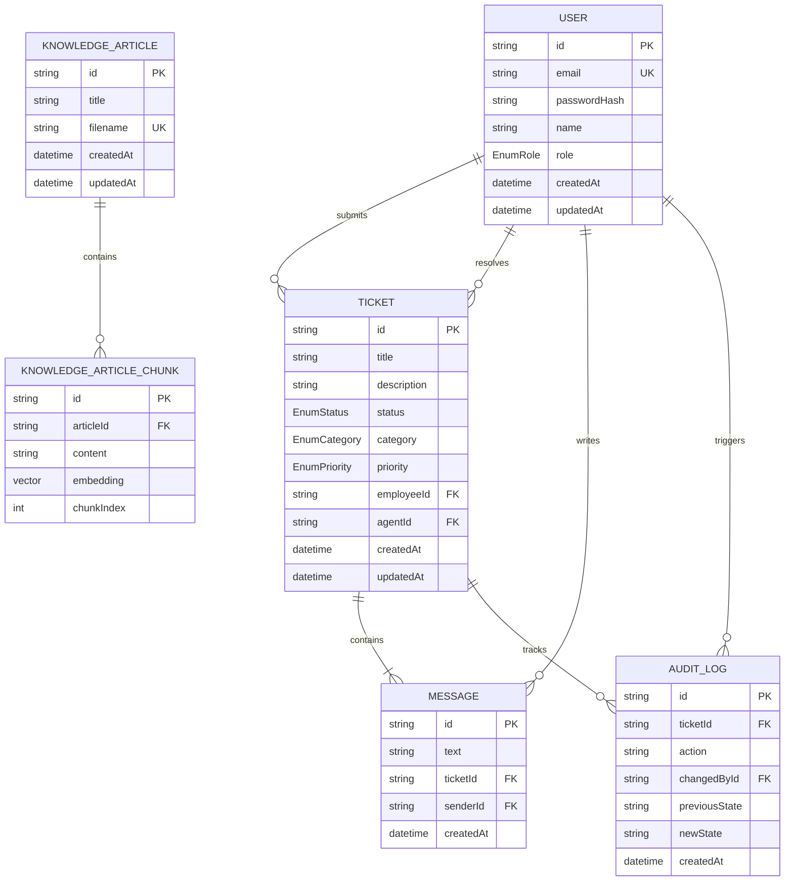

# QuickDesk - Database Specification

## Database Choice
We have selected **PostgreSQL** as the primary relational database for QuickDesk. PostgreSQL offers excellent reliability, transactional ACID compliance, and rich index types. Most importantly, it supports the **`pgvector`** extension, which allows us to store AI text embeddings alongside traditional relational records. This eliminates the need for a separate vector database (like Pinecone or Weaviate), reducing architecture complexity and enabling unified transactions.

---

## ER Diagram
Below is the relational database schema diagram highlighting table connections:



---

## Entities

### `User`
Stores system accounts, auth credentials, and permissions.
- `id` (String, UUID, PK): Unique identifier.
- `email` (String, UK): Employee/Agent login identifier.
- `passwordHash` (String): Securely hashed password.
- `name` (String): User's full name.
- `role` (Enum): `EMPLOYEE`, `AGENT`, or `ADMIN`.
- `createdAt` / `updatedAt` (DateTime).

### `Ticket`
Represents a customer support issue submitted by an employee.
- `id` (String, UUID, PK): Ticket identifier.
- `title` (String): Issue subject line.
- `description` (Text): Deep-dive description of the problem.
- `status` (Enum): `OPEN`, `IN_PROGRESS`, `RESOLVED`, `CLOSED`.
- `category` (Enum): `IT`, `HR`, `FINANCE`, `GENERAL`.
- `priority` (Enum): `LOW`, `MEDIUM`, `HIGH`, `URGENT`.
- `employeeId` (String, FK -> `User.id`): Ticket owner.
- `agentId` (String, Nullable, FK -> `User.id`): Assigned responder.
- `createdAt` / `updatedAt` (DateTime).

### `Message`
An individual communication entry in a ticket conversation room.
- `id` (String, UUID, PK).
- `text` (Text): Written communication.
- `ticketId` (String, FK -> `Ticket.id`): Linked thread.
- `senderId` (String, FK -> `User.id`): Author.
- `createdAt` (DateTime).

### `KnowledgeArticle` & `KnowledgeArticleChunk`
Splits KB docs into manageable parts to perform semantic searches.
- **KnowledgeArticle**: Tracks full files.
  - `id` (String, UUID, PK).
  - `title` (String): Document title (e.g. "VPN Setup Guide").
  - `filename` (String, UK): Source path.
- **KnowledgeArticleChunk**: Holds pieces of text and vector coordinates.
  - `id` (String, UUID, PK).
  - `articleId` (String, FK -> `KnowledgeArticle.id`).
  - `content` (Text): The raw text segment.
  - `embedding` (Vector, 768 dimensions): Mathematical representation.
  - `chunkIndex` (Int): Order within document.

### `AuditLog`
Audit trails recording every significant transition in a ticket's status.
- `id` (String, PK).
- `ticketId` (String, FK).
- `action` (String): e.g., `STATUS_UPDATE`, `AGENT_ASSIGNMENT`.
- `changedById` (String, FK).
- `previousState` / `newState` (String, Nullable).
- `createdAt` (DateTime).

---

## Relationships
1. **User - Ticket**: 1-to-Many connection. One employee can raise multiple tickets. One agent can manage multiple assigned tickets.
2. **Ticket - Message**: 1-to-Many cascading connection. When a ticket is deleted (rare), its message history deletes.
3. **Ticket - AuditLog**: 1-to-Many record tracking for quality control and resolution metric analyses.

---

## Indexes
To optimize standard dashboard query lookups and vector searches, we implement the following:

- **`idx_tickets_status_priority`** (B-Tree composite): Speeds up agent queues filtering open tickets by importance.
- **`idx_tickets_employeeId`** (B-Tree): Optimizes rendering the dashboard for a single logged-in employee.
- **`idx_messages_ticketId_createdAt`** (B-Tree composite): Optimizes chat thread queries sorted chronologically.
- **`idx_chunks_embedding`** (HNSW Vector Index): Employs the Hierarchical Navigable Small World algorithm on the embedding column. It speeds up the K-Nearest Neighbors (K-NN) searches using Cosine Distance calculations:
  ```sql
  CREATE INDEX ON "KnowledgeArticleChunk" 
  USING hnsw (embedding vector_cosine_ops);
  ```

---

## Constraints
- **Foreign Keys**: Cascading deletions set on messages, chunks, and audit logs. Assigning null sets on agent deletions.
- **Unique Constraints**: Unique constraint on `User.email` and `KnowledgeArticle.filename`.
- **Value validation**: Ticket statuses, roles, categories, and priorities must correspond directly to predefined enums.

---

## Enums
Defined inside the Prisma Schema as:

```prisma
enum Role {
  EMPLOYEE
  AGENT
  ADMIN
}

enum TicketStatus {
  OPEN
  IN_PROGRESS
  RESOLVED
  CLOSED
}

enum TicketCategory {
  IT
  HR
  FINANCE
  GENERAL
}

enum TicketPriority {
  LOW
  MEDIUM
  HIGH
  URGENT
}
```

---

## Migration Strategy
We use **Prisma Migrate** to execute schema transformations:

1. **Local Development**: Modifications are made in `prisma/schema.prisma`. Running `npx prisma migrate dev --name <migration_name>` generates SQL files and updates local Postgres database states.
2. **Production Deployment**: During containers/server deployment, the runtime executes:
   ```bash
   npx prisma migrate deploy
   ```
   This reads migrations in folder `backend/prisma/migrations` and applies pending actions inside transactions safely.

---

## Seed Data
The database initialization script (`backend/prisma/seed.ts`) populates the system with:

- **Default Accounts**:
  - `admin@company.com` (Role: `ADMIN`)
  - `agent.john@company.com`, `agent.sarah@company.com` (Role: `AGENT`)
  - `employee.bob@company.com`, `employee.alice@company.com` (Role: `EMPLOYEE`)
- **Initial Ticket Pool**: Mock data illustrating various ticket lifecycle stages (e.g. In-Progress IT issues, Open HR claims).
- **Knowledge Articles**: Loads markdown content from `/knowledge-base` directory directly into database, chunks them, sends text segments to Gemini for vectorization, and writes vector arrays to database to prep the RAG chat immediately.