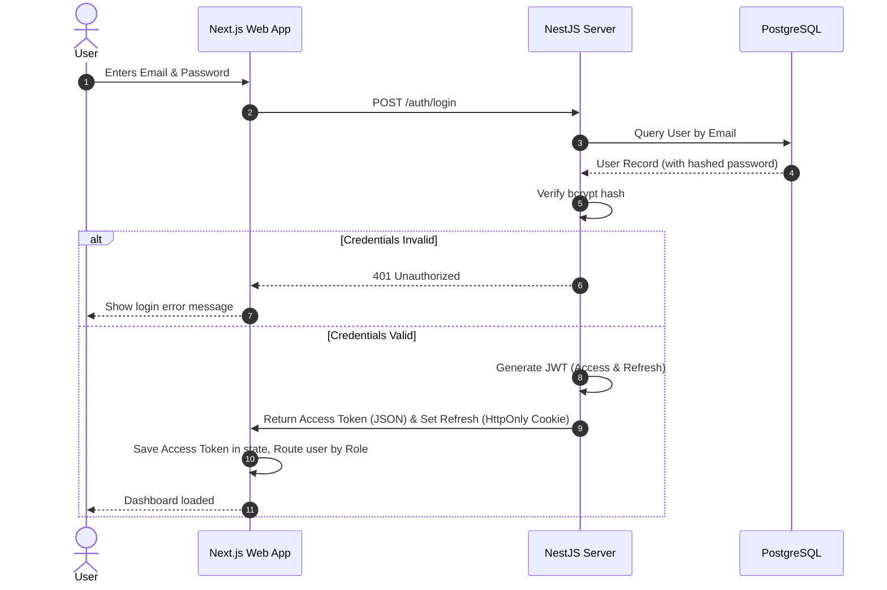

# QuickDesk - Authentication & Security Specification

QuickDesk implements a token-based authentication system coupled with Role-Based Access Control (RBAC) to ensure corporate data isolation.

---

## Authentication Flow



---

## JWT Properties
Our JSON Web Token structure is configured to balance performance and security:
- **Algorithm**: HMAC SHA-256 (`HS256`).
- **Access Token Expiry**: 15 minutes.
- **Refresh Token Expiry**: 7 days.
- **Token Payload**:
  ```json
  {
    "sub": "u-12345",
    "email": "employee.bob@company.com",
    "role": "EMPLOYEE",
    "iat": 1784894400,
    "exp": 1784895300
  }
  ```

---

## Password Hashing
To secure raw passwords:
- **Library**: `bcrypt` (Node.js wrapper).
- **Salt Rounds**: 10 (provides excellent defense against dictionary attacks while maintaining processing efficiency under 100ms per verification).
- **Procedure**:
  ```typescript
  import * as bcrypt from 'bcrypt';
  
  // Registration:
  const hash = await bcrypt.hash(rawPassword, 10);
  
  // Login verification:
  const isMatch = await bcrypt.compare(rawPassword, hash);
  ```

---

## Roles & Permissions Matrix
QuickDesk separates permissions across three hierarchical roles:

| API Namespace / Resource | Employee | Support Agent | Administrator |
| :--- | :---: | :---: | :---: |
| `POST /api/tickets` (Create) | ✅ | ✅ | ✅ |
| `GET /api/tickets` (View Own) | ✅ | ✅ | ✅ |
| `GET /api/agent/tickets` (View All) | ❌ | ✅ | ✅ |
| `PATCH /api/tickets/:id/assign` | ❌ | ✅ | ✅ |
| `PATCH /api/tickets/:id/status` | ❌ (Own close only) | ✅ | ✅ |
| `GET /api/admin/metrics/*` | ❌ | ❌ | ✅ |
| `POST /api/kb/upload` | ❌ | ❌ | ✅ |

---

## Protected Routes & Guards

### 1. Backend Guards (NestJS)
All protected controller actions are annotated with custom metadata guards:
```typescript
@UseGuards(JwtAuthGuard, RolesGuard)
@Roles(Role.AGENT, Role.ADMIN)
@Patch(':id/status')
async updateStatus(@Param('id') id: string, @Body() dto: UpdateStatusDto) {
  return this.ticketsService.updateStatus(id, dto);
}
```
- **`JwtAuthGuard`**: Uses Passport strategy to decode, inspect, and verify signature validity on the incoming Bearer token.
- **`RolesGuard`**: Checks the authenticated user's `role` property against roles declared in the `@Roles` metadata.

### 2. Frontend Guards (Next.js Middleware)
The client application uses NextJS Middleware to inspect stored session claims and intercept unauthorized directory navigation:
- Paths matching `/employee/*` intercept users lacking `EMPLOYEE` or higher rights, redirecting to `/login`.
- Paths matching `/agent/*` restrict access to users lacking the `AGENT` or `ADMIN` role.
- Paths matching `/admin/*` restrict access strictly to `ADMIN` accounts.

---

## Refresh Strategy (Token Rotation)
To prevent session disruption, the client rotates tokens silently in the background:
1. **Access Token Storage**: Stored exclusively in local memory (React Context state) to prevent Cross-Site Scripting (XSS) leaks.
2. **Refresh Token Storage**: Stored in a secure cookie marked as:
   - `HttpOnly`: Prevents JavaScript code from accessing the cookie.
   - `Secure`: Transmitted only over HTTPS.
   - `SameSite=Strict`: Protects against Cross-Site Request Forgery (CSRF).
3. **Rotation Endpoint**: When the access token is about to expire, the Next.js client sends a request to `/api/auth/refresh`. The server checks the refresh cookie, queries the user validity, and returns a new Access Token.

---

## Security Notes
- **CORS Config**: Access is limited to registered corporate origins (e.g. `*.company.com`). Wildcards are disabled.
- **WebSocket Handshake Validation**: Sockets must pass JWT validation during the handshake phase:
  ```javascript
  const socket = io("http://localhost:3000", {
    auth: {
      token: "Bearer " + accessToken
    }
  });
  ```
  Handshakes lacking valid authorization tokens are disconnected before opening connections.
- **Input Sanitization**: Rich-text fields and messages are sanitized using library libraries to prevent SQL Injection (handled by Prisma parameter bindings) and DOM XSS injections in the chat UI.