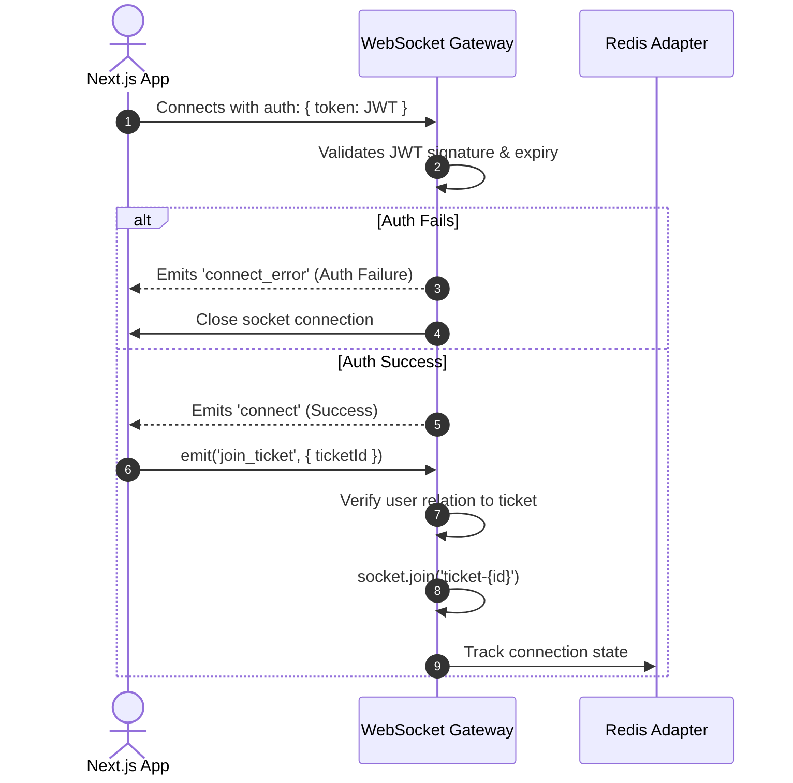

# QuickDesk - Realtime Communications Specification

QuickDesk uses **Socket.io** to provide bi-directional, low-latency communication between support agents and employees.

---

## Socket Gateway
The backend contains a NestJS WebSocket Gateway module (`realtime.gateway.ts`) built on top of `@socket.io/redis-adapter` (for horizontal scaling) and `@nestjs/websockets`.

- **Namespace**: `/api/ws`
- **Port**: Inherits application port (runs alongside HTTP listener).
- **Authentication**: Validated during handshake using JWT middleware:
  ```typescript
  io.use((socket, next) => {
    const token = socket.handshake.auth.token;
    try {
      const decoded = jwt.verify(token, process.env.JWT_SECRET);
      socket.data.user = decoded; // Attach user metadata to connection instance
      next();
    } catch (err) {
      next(new Error("Authentication error"));
    }
  });
  ```

---

## Events Summary

We use two primary socket broadcast mechanisms:
1. **Targeted Rooms**: Restricts updates to stakeholders of a specific ticket.
2. **Channel Broadcasts**: Distributes events to all members of a role channel (e.g. `channel-agents`).

---

## Client-to-Server Events

The Next.js client emits the following signals to the server:

### `join_ticket`
Join the room of a specific ticket.
- **Payload**:
  ```json
  { "ticketId": "t-8878" }
  ```
- **Action**: Gateway validates the socket's userId is either the ticket owner or a support agent, then executes `socket.join('ticket-t-8878')`.

### `leave_ticket`
Exit the room of a specific ticket.
- **Payload**:
  ```json
  { "ticketId": "t-8878" }
  ```

### `send_message`
Sends a new message to the active chat room.
- **Payload**:
  ```json
  {
    "ticketId": "t-8878",
    "text": "Hello, I still cannot access the portal after clearing cache."
  }
  ```

### `typing_start` / `typing_stop`
Indicates active typing to the other party.
- **Payload**:
  ```json
  { "ticketId": "t-8878" }
  ```

---

## Server-to-Client Events

The gateway emits the following signals:

### `message_received`
Broadcasts new message entries to all clients connected in room `ticket-{id}`.
- **Payload**:
  ```json
  {
    "id": "msg-992",
    "ticketId": "t-8878",
    "sender": { "id": "u-12345", "name": "Alice Smith" },
    "text": "Hello, I still cannot access the portal after clearing cache.",
    "createdAt": "2026-07-24T12:05:00Z"
  }
  ```

### `ticket_updated`
Emitted to `ticket-{id}` and `channel-agents` when status, category, or priority variables change.
- **Payload**:
  ```json
  {
    "ticketId": "t-8878",
    "changedFields": {
      "status": "IN_PROGRESS",
      "agentId": "u-agent-44"
    },
    "updatedAt": "2026-07-24T12:06:00Z"
  }
  ```

### `typing_status`
Pushes typing indicators in real-time.
- **Payload**:
  ```json
  {
    "ticketId": "t-8878",
    "userId": "u-12345",
    "isTyping": true
  }
  ```

---

## Connection Flow

The lifecycle of a realtime connection proceeds as follows:



---

## Reconnection Strategy
Network stability is handled by configuring the client-side Socket.io manager:

```typescript
const socket = io("/api/ws", {
  auth: { token: "Bearer " + token },
  reconnection: true,             // Enable auto reconnection
  reconnectionAttempts: 10,       // Try 10 times before failing
  reconnectionDelay: 1000,        // Start with 1s delay
  reconnectionDelayMax: 5000,     // Max delay of 5s between retries
  randomizationFactor: 0.5,       // Add jitter to prevent storming server
});
```

### State Recovery on Reconnect:
1. **Event Buffer**: The client buffers message emissions during offline periods, pushing them once connection state resolves.
2. **Room Re-Entry**: Upon triggering the `reconnect` event, the client loops through active React view routes and re-emits `join_ticket` for active panels, ensuring updates resume automatically.